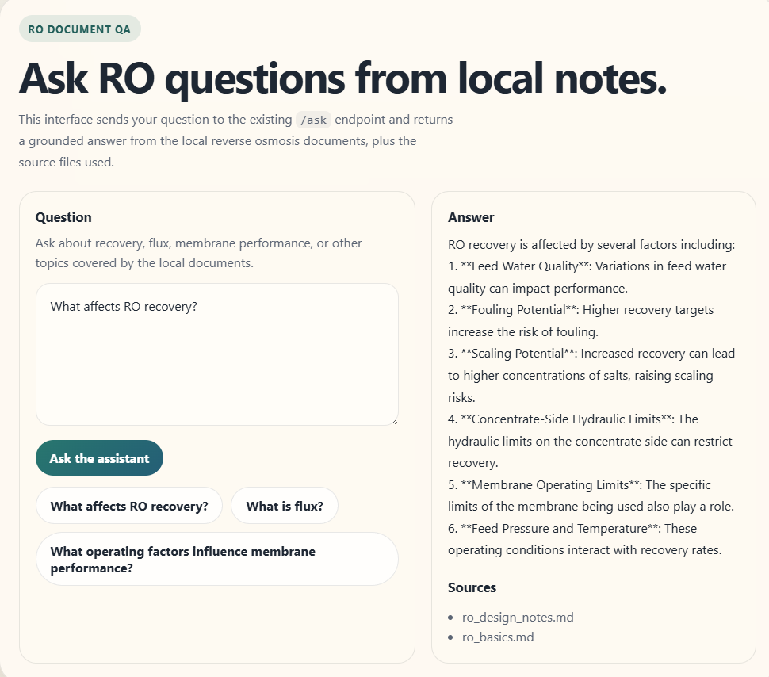
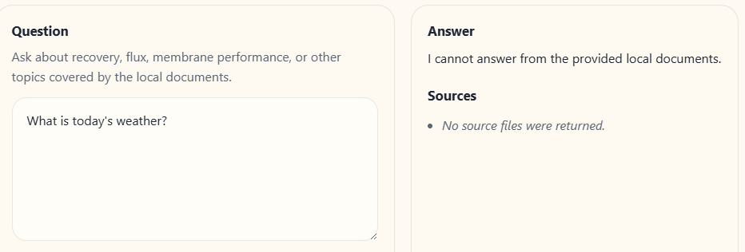

# LangChain RO Knowledge Assistant

LangChain RO Knowledge Assistant is a small FastAPI application for grounded question answering over local reverse osmosis notes.

It serves a browser UI at `/`, exposes `GET /health` and `POST /ask`, retrieves content from local markdown files in `data/`, and returns an answer with source files. If an OpenAI-compatible API key is configured, the final answer is generated from retrieved context. Without an API key, the app returns a deterministic fallback answer from the matched local text.

## Highlights

- Single FastAPI service for UI and API
- LangChain document loading and chunking
- Lexical retrieval over local markdown notes
- Grounding checks for unsupported questions
- Optional OpenAI-compatible LLM answer generation
- Pydantic request and response models

## Screenshots

### Browser Interface



### Unsupported Question Refusal




## Quick Start

```powershell
py -3.11 -m venv .venv
.\.venv\Scripts\Activate.ps1
python -m pip install --upgrade pip
python -m pip install -r requirements.txt
Copy-Item .env.example .env
.\.venv\Scripts\python.exe -m uvicorn app.main:app --host 127.0.0.1 --port 8000
```

Open [http://127.0.0.1:8000](http://127.0.0.1:8000).

## Configuration

Settings are loaded from `.env`.

```env
OPENAI_API_KEY=your-api-key
OPENAI_BASE_URL=https://api.openai.com/v1
OPENAI_MODEL=gpt-4o-mini
APP_HOST=127.0.0.1
APP_PORT=8000
```

`OPENAI_API_KEY` is optional.

- With an API key, the app uses retrieved context to generate the final answer.
- Without an API key, the app returns a fallback answer from local notes.

## How It Works

1. A user opens `/` or sends `POST /ask`.
2. Markdown files in `data/` are loaded and split into chunks.
3. The query is normalized before retrieval. For example, `RO` is expanded to `reverse osmosis`.
4. Chunks are ranked by lexical token overlap with the normalized query.
5. A grounding check verifies that the retrieved content still supports the question.
6. If no grounded match exists, the app returns `I cannot answer from the provided local documents.`
7. If grounded content exists and `OPENAI_API_KEY` is set, the retrieved context is sent to the LLM.
8. If no API key is set, the app returns a deterministic fallback answer from the best matching paragraph.
9. The response includes the answer and supporting source files.

## API

### `GET /`

Serves the browser interface.

### `POST /ask`

LLM will return the answer grounded on user questios and retrived docs.

PowerShell example:

```powershell
Invoke-RestMethod -Method Post -Uri http://127.0.0.1:8000/ask -ContentType 'application/json' -Body '{
  "question": "What is RO?"
}' | ConvertTo-Json -Depth 5
```

## Retrieval And Grounding

The retrieval path is intentionally simple and local.

- Documents are loaded from `data/`
- Text is split with `RecursiveCharacterTextSplitter`
- Queries are normalized before retrieval
- Chunks are ranked by token overlap with the normalized query
- A grounding gate rejects questions not supported by retrieved content
- Acronym-style queries such as `RO` are expanded before scoring

This keeps the behavior deterministic and easy to inspect on a small corpus.

## Project Structure

```text
LangChain-RO-Knowledge-Assistant/
├── app/
│   ├── chains.py
│   ├── config.py
│   ├── main.py
│   ├── models.py
│   ├── prompts.py
│   └── static/
│       └── index.html
├── data/
│   ├── glossary.md
│   ├── membrane_summary.md
│   ├── ro_basics.md
│   └── ro_design_notes.md
├── IMG/
│   ├── fail_case.png
│   └── use_case1.png
├── tests/
│   └── test_assistant.py
├── .env.example
├── requirements.txt
└── README.md
```

## Key Files

- `app/main.py`: FastAPI routes for `/`, `/health`, and `POST /ask`
- `app/chains.py`: document loading, retrieval, grounding, fallback logic, and LLM orchestration
- `app/prompts.py`: prompt template used in LLM mode
- `app/config.py`: `.env`-backed settings
- `data/*.md`: local RO knowledge base
- `tests/test_assistant.py`: focused assistant behavior tests

## Limitations

- The knowledge base is limited to the markdown files in `data/`
- Retrieval is lexical and optimized for a small local corpus
- The grounding check is intentionally conservative
- Answer quality depends on document coverage and wording
- This is a local prototype, not a production retrieval system
